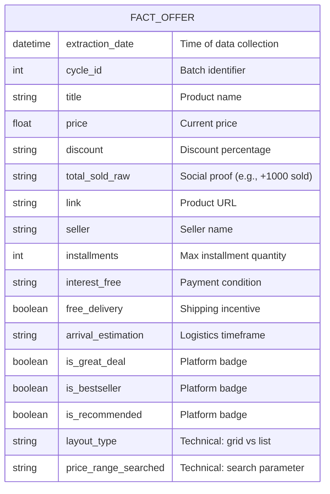

# Samsung Market Intelligence - Business Context

Context document for the **Samsung Market Intelligence** project. This repository demonstrates, end-to-end, the construction of a **Data Engineering, Data Analyst, Data Scientist, and Machine Learning** pipeline for monitoring, analyzing, and forecasting Samsung smartphone prices on Mercado Livre. The project utilizes a robust architecture featuring **Docker, Prometheus, Structured Logging**, and integration tests.

## 1. Study Purpose

The primary goal of this project is to bridge the gap between isolated data scripts and **production-grade Data Platforms**. I aim to provide a public, fully reproducible blueprint that demonstrates how to design, architect, and deploy a robust "End-to-End" solution.

While many data portfolios focus solely on the "Happy Path" inside local Notebooks, this study simulates a **hostile, real-world production environment** on a Virtual Private Server (VPS), prioritizing three core pillars:

* **Operational Excellence & Observability**: moving beyond simple print statements to implement an enterprise-grade monitoring stack (**Prometheus & Structured Logging**). The goal is to prove that "Code that cannot be monitored is code that cannot be trusted in production."
* **Collection Resilience (Anti-Fragility)**: Engineering a system capable of withstanding the chaotic nature of the web. This involves implementing **Circuit Breakers**, dynamic wait times, and defensive programming to handle network latency, Soft Bans, and HTML layout shifts without crashing the pipeline.
* **Competitive Intelligence as a Product**: Treating data not as a byproduct, but as a strategic asset. The project is designed to answer complex business questions about market dynamics, inflation, and pricing strategies in the consumer electronics sector.

## 2. Business Objectives

1.  **Strategic Market Analysis**: Establish a granular historical database to map price volatility, identifying inflation/deflation trends and the natural depreciation curve of Samsung electronics over their product lifecycle.
2.  **Predictive Data Asset Creation**: Construct a high-fidelity, proprietary dataset specifically engineered to train and validate **Time Series Forecasting** models, creating a foundation for predictive analytics rather than just descriptive reporting.
3.  **Engineering Excellence (DataOps)**: Prove the application of robust **Software Engineering** principles within the Data domain, ensuring pipeline reliability through automated testing (Integration/Unit), Continuous Integration (CI/CD), and proactive Observability (Monitoring/Alerting).
4.  **Algorithmic Decision Support**: Develop an automated mechanism to identify "Great Deals" (arbitrage opportunities) by detecting statistical deviations (outliers) against calculated moving averages, distinguishing real discounts from fake promotions.

## 3. Scope and Boundaries

**In Scope (End-to-End Data Pipeline)**
This project is designed to demonstrate a full-cycle data product, covering the responsibilities of multiple data roles:
-   **Data Engineering**: Implementation of a robust **ETL Pipeline** (Extract, Transform, Load) with resilient scraping of Samsung smartphones (New & Refurbished) on Mercado Livre. Includes raw/processed storage strategies and infrastructure management via Docker/VPS.
-   **Data Analysis**: Data sanitization, outlier detection, and descriptive analysis to understand historical availability and price volatility.
-   **Data Science**: Development of **Time Series Forecasting** models (e.g., ARIMA, Prophet) to predict future price trends based on historical windows.
-   **ML Engineering**: Operationalization of the model pipeline, ensuring reproducibility and preparing the architecture for future inference serving.
-   **Observability**: Real-time technical monitoring of Scraper Health, Soft Bans (Captcha rates), Request Latency, and System Resource Usage.

**Out of Scope (Current Phase)**
-   **Automated Purchasing Bot**: Excluded due to the complexity of transactional state management. Implementing a buying bot requires handling sensitive PII data, bypassing complex 2FA (Two-Factor Authentication), managing payment gateway interactions, and overcoming aggressive anti-bot security layers, which poses significant security and legal risks compared to read-only extraction.
-   **Multi-Marketplace Collection**: Expansion to platforms like **Amazon, Magalu, Shopee, or AliExpress** is postponed to Phase 2 to focus on architectural depth within a single domain first.
-   **Sentiment Analysis (NLP) on Reviews**: Excluded because it requires a fundamental architectural shift from *Scraping* to *Crawling*.
    -   *Technical Constraint*: Collecting reviews requires navigating into individual product pages and simulating user interactions (e.g., infinite scroll-down events, dynamic button clicks) to load AJAX-injected content.
    -   *Tooling Shift*: This would likely require heavy-browser automation tools like **Selenium** or **Playwright** to handle the dynamic DOM, significantly increasing latency and resource consumption compared to the current lightweight Request/Soup architecture.

## 4. Stakeholders and Personas

-   **Smart Shopper**: The end-user seeking the ideal purchasing moment based on the lowest historical price.
-   **Seller/Competitor**: Monitors market price fluctuations to adjust pricing strategies.
-   **Data Engineer**: Architects the high-availability **ETL pipeline**, managing the scraper infrastructure (Docker/VPS) and ensuring the continuous flow of raw data.
-   **Data Analyst**: Conducts rigorous data cleaning and **Exploratory Data Analysis (EDA)** to uncover historical patterns, seasonality, and descriptive insights.
-   **Data Scientist**: Develops **Time Series Forecasting** models and prescriptive algorithms to predict future price trends and optimize purchase timing.
-   **Machine Learning Engineer**: Operationalizes the predictive models, handling model deployment, versioning, and integration into the production environment.

## 5. Key Business Questions

This project aims to answer specific strategic questions through data evidence:

-   **SKU-Level Price Volatility & Depreciation**:
    -   What is the standard deviation of prices for flagship models (e.g., S23 Ultra) compared to budget lines (e.g., A54)?
    -   Can we plot the "depreciation curve" to predict how much value a device loses 30, 60, or 90 days after a major launch?

-   **Temporal Patterns & Seasonality**:
    -   Are there statistically significant price drops on specific days of the week (e.g., Tuesday markdowns) or specific times of the month (e.g., post-payday spikes)?
    -   Can we detect "artificial inflation" cycles where sellers raise prices just before a sale event to simulate a larger discount?

-   **Market Composition (New vs. Refurbished)**:
    -   What is the real-time ratio of New vs. Refurbished inventory?
    -   How does the release of a new generation (e.g., S24) impact the supply volume and price floor of the previous generation's refurbished units?

-   **Competitive Landscape (Share of Shelf)**:
    -   Which sellers consistently dominate the first search result page (organic ranking)?
    -   Is the market fragmented among many small sellers, or concentrated in a few "Platinum" stores?
    -   What is the price correlation between a seller's reputation (Gold/Platinum) and their pricing power?

-   **Total Cost of Ownership (TCO) Analysis**:
    -   Does "Free Shipping" actually result in a lower final price, or is the shipping cost often embedded in the base product price?
    -   What is the average premium a consumer pays for "Full Fulfillment" (fast delivery) versus standard shipping?

## 6. Target KPIs and Metrics (Pilot Phase: Dec 23, 2025 – Jan 23, 2026)

This project is currently in a **30-day continuous data collection phase**. The metrics are divided into two tiers: operational metrics (monitored via Prometheus/Grafana) and analytical metrics (to be calculated post-ETL).

### 6.1. Operational Metrics (Real-Time Engineering Health)
*These are actively tracked to ensure the high availability of the collection agent on the VPS.*

-   **Collection Success Rate (CSR)**: The ratio of successful HTTP `200 OK` responses versus client errors (`4xx`) or blocks (`403`/Captcha).
    -   *Goal*: Maintain CSR > 95%.
-   **Cycle Throughput & Latency**: The total duration of a full scraping cycle (0-20k BRL range) and the average latency per page request.
    -   *Why*: To detect network throttling or VPS resource exhaustion (CPU/RAM).
-   **Daily Ingestion Volume**: The count of raw rows appended to the CSV/DB per 24-hour window.
    -   *Why*: To monitor storage growth and verify if the marketplace layout changes (which causes sudden drops in extracted items).
-   **Soft Ban Frequency**: The number of times the "Circuit Breaker" is triggered per hour.
    -   *Action*: Used to tune random sleep intervals and User-Agent rotation strategies.

### 6.2. Analytical Metrics (Business & Data Science Development)
*Logic being developed during the collection window to facilitate immediate analysis upon phase completion.*

-   **Price Dispersion & Volatility Index**: Calculation of the standard deviation of prices for specific SKUs (e.g., S23 Ultra 256GB) over the 30-day window to identify stable vs. volatile assets.
-   **"True" Market Price**: A robust aggregation (Median or Trimmed Mean) that filters out outliers (fake cheap listings) and overpriced scalpers to determine the realistic daily street price.
-   **New vs. Refurbished Split**: The percentage ratio of "Condition: New" vs. "Condition: Used/Refurbished" offers per model.
    -   *Hypothesis*: Does the supply of refurbished units increase after Christmas (Dec 25)?
-   **Seller Dominance (Share of Shelf)**: A metric identifying which sellers appear most frequently in the top 3 search pages.
-   **Opportunity Score**: A calculated score that flags an offer if `Current_Price < (30_Day_Moving_Average - 1.5 * Std_Dev)`.

## 7. Essential Business Rules & Technical Policies

To ensure the reliability of the dataset and the stability of the collection infrastructure, the following strict rules are enforced within the pipeline:

-   **Resilience & Adaptive Throttling (Circuit Breaker Pattern)**:
    -   The system must autonomously detect "Soft Bans" (e.g., HTTP 429 Too Many Requests, Captcha redirects, or sudden 403 Forbidden spikes).
    -   Upon detection, the **Circuit Breaker** opens, halting execution immediately to protect the IP reputation.
    -   Recovery involves an **Exponential Backoff** strategy with randomized "Jitter" (sleep intervals) to mimic human behavior before retrying.

-   **Data Integrity & Quality Gates**:
    -   **Strict Schema Enforcement**: Records are only persisted if they meet the "Gold Standard": Non-null Price, Non-null Title, and Valid URL.
    -   **Sanitization at Ingestion**: Currency symbols (R$) and formatting artifacts are stripped *before* storage to ensure numerical consistency.
    -   **Garbage Rejection**: Incomplete or malformed HTML parsings are discarded and logged as warnings, preventing "noise" from corrupting the analytical dataset.

-   **Auditability & Full Observability**:
    -   **Traceability**: Every data point includes metadata (`cycle_id`, `extraction_timestamp`) linking it back to the specific execution run that generated it.
    -   **Structured Logging**: All application events are emitted in JSON format (Loguru), ready for ingestion by log aggregators (e.g., ELK Stack, Datadog).
    -   **Metric Exposure**: Critical health indicators (Success Rate, Latency) are exposed via a `/metrics` endpoint for Prometheus scraping.

-   **Immutable History & Partitioning**:
    -   **Append-Only Strategy**: Historical data is treated as an immutable ledger. We never update existing rows; we only append new snapshots.
    -   **Time-Travel Analysis**: This approach allows us to reconstruct the market state at any specific point in the past, which is crucial for training Time Series models without "Data Leakage."
    -   **Partitioning**: Data is logically partitioned by `extraction_date` to optimize query performance and manage file sizes.

## 8. Detailed Architecture Journey (Pipeline)

The system follows a linear **ELT (Extract, Load, Transform)** architecture designed for high availability and fault tolerance. Each stage is decoupled and logged independently.

### 8.1. Orchestration & Provisioning Layer
-   **Scheduling (Cron/Airflow)**: Acts as the trigger mechanism. In the current VPS implementation, a lightweight scheduler initiates the daily batch job.
-   **Container Initialization**: The Docker engine provisions an ephemeral, isolated environment (`python:3.12-slim`), ensuring dependency consistency and a clean state for every execution cycle.

### 8.2. Extraction Layer (The "Scraper")
-   **Request Rotation Strategy**: The system initializes a pool of User-Agents to mimic different browsers (Chrome, Firefox, Safari) and operating systems.
-   **Resilient HTTP Requests**: Requests are sent with randomized "Jitter" (delays) and robust timeout handling.
-   **Circuit Breaker**: If the target site responds with `429` (Too Many Requests) or Captchas, the pipeline automatically pauses execution to protect IP reputation.

### 8.3. Transformation & Parsing Layer
-   **DOM Traversal (BeautifulSoup)**: Raw HTML is parsed to locate specific CSS selectors (`.poly-card`, `.ui-search-layout`).
-   **Layout Agnosticism**: The parser dynamically detects if the marketplace is serving a "Grid" or "List" layout and adapts the extraction strategy on the fly.

### 8.4. Quality Assurance (QA) Layer
-   **Schema Validation**: Extracted data passes through a validation gate.
    -   *Rule*: Does it have a Title? Is the Price numeric? Is the URL valid?
-   **Data Sanitization**: Cleaning of currency symbols (e.g., removing `R$`, `.`), whitespace trimming, and type casting (String → Float).

### 8.5. Persistence Layer
-   **Atomic Writes**: Validated records are appended to the dataset (`data/raw/`).
-   **Format**: Currently utilizing **CSV** for portability, with a planned migration to **PostgreSQL** for relational querying and data integrity constraints.

### 8.6. Observability Layer
-   **Telemetry**: Throughout the entire lifecycle, the system emits:
    -   **Structured Logs (JSON)**: For debugging and audit trails via Loguru.
    -   **Prometheus Metrics**: Real-time gauges and counters (e.g., `scraper_items_collected_total`, `scraper_request_latency_seconds`) exposed on port `9090`.

## 9. Data Schema & Entity Relationship

The scraping pipeline generates a flat schema where each row represents a unique product offer at a specific point in time. The data is logically grouped into the following entities:



## 10. Architectural Decisions & Tech Stack

The architecture was designed based on the **Twelve-Factor App** methodology, prioritizing portability, parity between development/production, and rigorous observability.

### 10.1. Core Runtime: Python 3.12
-   **Why Python?**: Unrivaled ecosystem for Data Engineering (`pandas`, `requests`) and parsing (`BeautifulSoup`).
-   **Why Version 3.12?**: Leveraging the latest performance optimizations (Specializing Adaptive Interpreter) and enhanced error messages.
-   **Strict Typing**: Extensive use of **Type Hints** (`typing.List`, `typing.Dict`, `Pydantic`) to enforce code quality and enable static analysis tools to catch bugs before runtime.

### 10.2. Infrastructure as Code: Docker & Docker Compose
-   **Reproducibility**: The `Dockerfile` (based on `python:3.12-slim`) guarantees that the execution environment is bit-for-bit identical on the Windows development machine and the Linux VPS.
-   **Service Orchestration**: `docker-compose` manages the lifecycle of the application and, crucially, defines **Persistent Volumes**. This ensures that even if the container crashes or updates, the collected dataset (`/data`) and logs (`/logs`) are preserved on the host disk.

### 10.3. Observability Strategy (The "Eyes" of the System)
A headless scraper on a VPS cannot be debugged with `print()`. We implemented a dual-layer telemetry stack:

-   **Layer 1: Structured Logging (Loguru)**
    -   Instead of unstructured text, we emit **JSON Logs**.
    -   *Rationale*: JSON logs are machine-readable, allowing for future ingestion into centralized log management systems (ELK Stack, Datadog, or AWS CloudWatch) without complex parsing rules.
    -   *Audit Trail*: Every log entry contains context (`cycle_id`, `function_name`) to trace errors back to the specific execution loop.

-   **Layer 2: Time-Series Metrics (Prometheus Client)**
    -   We expose a lightweight HTTP server on port `9090` (`/metrics`).
    -   *Rationale*: This follows the **Pull Model**. Instead of the app pushing heavy data to a DB, it simply exposes current counters (e.g., `samsung_items_scraped_total`, `system_cpu_usage`). This is the industry standard for monitoring microservices health.

### 10.4. Quality Assurance (Testing Pyramid)
-   **Integration over Mocking**: For Web Scraping, "pure" unit tests often pass while the scraper fails in reality because the site changed.
    -   *Decision*: We prioritize **Integration Tests** (`tests/integration/`) that actually hit the target URL (in a controlled Single Run mode) to verify DOM structure, network connectivity, and write permissions.
-   **Pytest Fixtures**: Utilized to manage setup and teardown of test artifacts (e.g., creating and deleting temporary CSV files), ensuring that tests are stateless and do not leave garbage data behind.

## 11. Non-Functional Requirements (NFRs) & Quality Attributes

The system architecture prioritizes stability and operational efficiency over raw speed, adhering to the following quality constraints:

### 11.1. Security & Configuration Management
-   **Secrets Management**: Adheres to the **12-Factor App** principles. No credentials or sensitive configuration (e.g., database connection strings, API tokens) are hardcoded. All configuration is injected via **Environment Variables** (`.env` file) or Docker Compose environment mapping.
-   **Least Privilege**: The Docker container runs as a non-root user (where applicable) and only maps specific volumes necessary for operation (`/data` and `/logs`), limiting the blast radius of any potential container compromise.

### 11.2. Performance & Resource Optimization
-   **Resource Efficiency**: Designed to run on low-cost hardware (Tier 1 VPS: 1 vCPU, 4GB RAM). The memory footprint is minimized by processing items in batches and streaming data to disk (Append-Only) rather than holding massive DataFrames in memory.
-   **"Humanized" Throttling**: Unlike typical high-performance systems that optimize for *speed*, this system optimizes for *stealth*. It implements **Jitter** (Randomized Delays: `2.5s - 5.0s`) and long sleep cycles (`6 hours`) to mimic human browsing patterns, reducing the CPU/Network load and avoiding IP blacklisting.

### 11.3. Maintainability & Code Quality
-   **Separation of Concerns (SoC)**: The codebase is structured into distinct modules. The `monitoring` package is completely decoupled from the `scraper` logic, ensuring that changing the logging tool doesn't break the extraction engine.
-   **SOLID Principles**:
    -   *Single Responsibility*: The `scraper.py` extracts data, `logger.py` handles output, `metrics.py` handles counting.
    -   *Singleton Pattern*: Used in `metrics.py` to ensure a single source of truth for application counters across threads.
-   **Type Safety**: Usage of Python 3.12 Type Hints enables static analysis (via Pylance/MyPy), reducing runtime type errors.

### 11.4. Portability & Reproducibility
-   **Infrastructure as Code (IaC)**: The `Dockerfile` and `docker-compose.yml` define the entire infrastructure state. This guarantees **Environment Parity**—if it runs on the developer's Windows machine via Docker Desktop, it is mathematically guaranteed to run on the Debian VPS.
-   **Dependency Locking**: `requirements.txt` pins specific versions of libraries (e.g., `pandas==2.2.0`), preventing "it works on my machine" bugs caused by upstream updates in the future.

### 11.5. Reliability & Fault Tolerance
-   **Graceful Degradation**: If the network fails or the target site throws a 500 Error, the scraper does not crash. It logs the error, waits, and retries (Retry Pattern) or enters a "Cool Down" sleep mode, ensuring the process stays alive 24/7 without manual intervention.

## 12. Environment & Tooling Stack

The project leverages a modern **DataOps stack** to ensure code quality, reproducibility, and production stability.

-   **Containerization (Docker & Docker Compose)**:
    -   Used to create an **agnostic execution environment** (`python:3.12-slim`), ensuring that the scraper runs identically on Windows (Dev) and Linux (Prod).
    -   **Docker Compose** orchestrates the multi-container architecture and manages volume persistence (`./data` mapping), ensuring data safety even during container recycles.

-   **Integrated Development Environment (VS Code)**:
    -   Configured with Pylance for static typing checks and the Docker extension for container management.
    -   Utilized for **Remote Development (SSH)** to debug code directly on the VPS instance without cloning repos locally.

-   **Version Control (Git & GitHub)**:
    -   Adheres to the **Gitflow Workflow**:
        -   `main`: Production-ready code (deployed to VPS).
        -   `develop`: Integration branch for testing new features.
        -   `feat/xyz`: Isolation branches for atomic tasks (e.g., `feat/circuit-breaker`).
    -   **Semantic Commits** (`feat:`, `fix:`, `chore:`) are enforced for clear audit history.

-   **Production Infrastructure (VPS)**:
    -   **Provider**: Hostinger (KVM 1 Tier).
    -   **Specs**: 1 vCPU, 4GB RAM, 50GB NVMe SSD (Optimized for I/O operations).
    -   **OS**: Linux (Debian/Ubuntu) running in headless mode.
    -   **Role**: Hosts the Docker daemon for 24/7 continuous data collection, guaranteeing 99.9% uptime for the scraping agent.

## 13. Repository Structure & Architecture

The project follows a **Modular Pattern** tailored for Data Engineering. The code is organized to separate business logic (Scraping) from cross-cutting concerns (Monitoring, Config) and infrastructure (Docker).

```text
.
├── data/                   # Local Data Lake (Volume Mapped in Docker)
│   ├── raw/                # Immutable ingestion landing zone (Append-Only CSVs)
│   └── processed/          # Cleaned data ready for Analytics (Future Parquet/DB)
├── logs/                   # Rotated Structured JSON logs (Persisted on VPS disk)
├── src/                    # Application Source Code
│   ├── monitoring/         # Enterprise Observability Package
│   │   ├── __init__.py     # Module initialization
│   │   ├── config.py       # Dynamic configuration & Environment Variables
│   │   ├── logger.py       # Loguru wrapper for JSON Structured Logging
│   │   └── metrics.py      # Prometheus Custom Collector (Singleton Pattern)
│   ├── __init__.py         # Source initialization
│   └── scraper.py          # Main ETL Entrypoint (Extraction Engine)
├── tests/                  # QA & Testing Pyramid
│   ├── integration/        # End-to-End Pipeline Verification (Real Network)
│   └── unit/               # Parsing Logic Isolation (HTML Mocks)
├── docker-compose.yml      # Service Orchestration (App + Volume Binding)
├── Dockerfile              # Multi-stage build definition (Python 3.12 Slim)
├── requirements.txt        # Pinned dependencies for reproducibility
└── README.md               # Business Context and Documentation
```

## 14. Project Roadmap to v1.0.0 (End-to-End)

This roadmap outlines the milestones required to evolve the project from a raw data scraper to a deployed predictive system, integrating **Data Engineering**, **Data Analytics**, **Data Science** and **Machine Learning Engineer**.

### Phase 1: Data Engineering & Infrastructure (The Foundation)
- [x] **Core Scraper**: Implementation of resilient scraping logic using `BeautifulSoup` and `Requests`.
- [x] **Observability**: Integration of **Prometheus** for metrics and **Loguru** for structured logging.
- [ ] **Infrastructure**: Deployment to a Linux VPS using **Docker** and **Docker Compose**.
- [ ] **CI/CD Pipeline**: Setup of GitHub Actions for automated testing (`pytest`) and linting (`flake8`) upon push.
- [ ] **Data Warehousing**: Migration from CSV to **PostgreSQL** to establish a robust source of truth.

### Phase 2: Data Analytics & EDA (The Insight)
- [ ] **Data Cleaning**: Pipeline to handle null values, deduplication, and outliers removal.
- [ ] **EDA (Exploratory Data Analysis)**: Statistical analysis to understand price distribution, volatility, and availability.
- [ ] **Dashboards**: Visualization of historical trends using tools like **Streamlit** or **Metabase**.
- [ ] **Business Logic Validation**: Validation of assumptions (e.g., "Do prices drop on weekends?").

### Phase 3: Feature Engineering & Time Series (The Science)
- [ ] **Time Series Decomposition**: Breaking down data into Trend, Seasonality, and Residuals.
- [ ] **Stationarity Tests**: Applying **ADF (Augmented Dickey-Fuller)** test to ensure time series stability.
- [ ] **Feature Engineering**: Creation of **Lags**, **Rolling Windows**, and Moving Averages for model inputs.
- [ ] **Autocorrelation Analysis**: Using **ACF** and **PACF** plots to determine optimal model parameters.

### Phase 4: Machine Learning & Forecasting (The Prediction)
- [ ] **Model Selection**: Benchmarking different algorithms:
    -   **ARIMA / SARIMA**: For capturing linear relationships and seasonality.
    -   **Prophet**: For handling holidays and changepoints.
    -   **XGBoost / LightGBM**: For regression-based forecasting.
- [ ] **Hyperparameter Tuning**: Optimization of model parameters (p, d, q) to minimize RMSE/MAPE.
- [ ] **Backtesting**: Validating model performance against historical data splits (Time Series Split).

### Phase 5: MLOps & Final Deployment (The Product)
- [ ] **Model Persistence**: Saving the trained model using `pickle` or `joblib`.
- [ ] **Inference API**: Serving predictions via a REST API (using **FastAPI**).
- [ ] **Retraining Pipeline**: Automated scripts to retrain the model as new data arrives (Continuous Learning).
- [ ] **v1.0.0 Release**: Full system launch with automated data collection and forecasting capabilities.

## 15. Risks and Mitigation Strategies

Operating a web scraper 24/7 on a limited-resource VPS (1 vCPU, 4GB RAM) presents specific challenges. The architecture implements the following defenses:

-   **Anti-Bot & Soft Bans (HTTP 429/Captcha)**
    -   *Risk*: Mercado Livre detecting the bot pattern and blocking the IP, halting data collection.
    -   *Mitigation*: Implementation of a **"Stochastic Circuit Breaker"**:
        1.  **Jitter**: Requests have randomized sleep intervals (`2.5s` to `5.0s`) to prevent time-based fingerprinting.
        2.  **Header Rotation**: A pool of 4 distinct User-Agents (Chrome/Firefox/Linux/Mac) rotates per cycle.
        3.  **Penalty Logic**: As seen in `src/scraper.py`, detection of "Captcha" or "Human verification" triggers an immediate **15-minute hard sleep** to cool down the IP reputation before retrying.

-   **HTML Layout Volatility (DOM Drift)**
    -   *Risk*: The marketplace A/B tests different frontend layouts (List View vs. Grid View), breaking CSS selectors.
    -   *Mitigation*: The `BeautifulSoup` parser utilizes a **Hybrid Selector Strategy**. It dynamically checks for `poly-card__content` (Grid) or `ui-search-layout__item` (List) and tags the record with `layout_type`. If both fail, the structured logger emits a specific parsing error with context, allowing for rapid hotfixes.

-   **Resource Exhaustion (OOM - Out of Memory)**
    -   *Risk*: The KVM 1 VPS has only 4GB of RAM. Loading large datasets into Pandas memory could crash the container.
    -   *Mitigation*:
        1.  **Stream Processing**: Data is processed in micro-batches (48 items per page) and appended to the CSV immediately (`mode='a'`), keeping the memory footprint constant regardless of dataset size.
        2.  **Garbage Collection**: The `scraper.py` forces a clean state reset at the start of every cycle.
        3.  **Prometheus Monitoring**: `system_memory_usage_bytes` is tracked. If usage spikes, the container restart policy (`unless-stopped`) ensures recovery.

-   **Data Loss due to Container Failure**
    -   *Risk*: If the Docker container crashes or the VPS restarts during an update.
    -   *Mitigation*: **Volume Mapping**: The `docker-compose.yml` binds the host directory `./data` to the container's `/app/data`. This writes data directly to the VPS **NVMe disk**, ensuring that the CSV dataset survives even if the container is destroyed.

## 16. Acceptance Criteria & Definition of Done (v0.1.0)

For the "MVP" (Minimum Viable Product) to be considered stable for the Pilot Phase, the following technical validations must be met:

### 16.1. Execution Stability (The "Smoke Test")
-   **Criteria**: The `src/scraper.py` script must execute in `SINGLE_RUN` mode (triggered via the `test_full_scraper_cycle`) without throwing unhandled exceptions (SystemExit code 0).
-   **Verification**: The logs must show a clean entry for `Event: cycle_finished` followed by `Single Run Requested. Stopping loop`.

### 16.2. Data Persistence & Schema Integrity
-   **Criteria**: Raw data must be successfully persisted to the **NVMe volume** at `data/raw/samsung_market_data.csv`.
-   **Validation Logic**:
    -   File exists after execution.
    -   Encoding is `utf-8-sig` (to handle Portuguese accents).
    -   Separator is correctly defined as `;` (semicolon).
    -   **Critical Columns**: `title`, `price`, `link`, and `extraction_date` are populated and non-null (validated by `tests/integration/test_scraper_execution.py`).

### 16.3. Observability Compliance (Logs)
-   **Criteria**: The application must produce **Structured JSON Logs** to allow for future ingestion (ELK/Datadog).
-   **Verification**:
    -   A log file is created at `logs/scraper_execution_YYYYMMDD.log`.
    -   Entries must follow the JSON schema: `{"text": "...", "record": {"extra": {"context": ...}}}`.
    -   The `scraper_initialization` event is recorded at startup.

### 16.4. Telemetry Exposure (Metrics)
-   **Criteria**: The **Prometheus Client** must successfully bind to port `9090` inside the container.
-   **Verification**:
    -   A `GET /metrics` request returns `200 OK`.
    -   Custom metric `samsung_items_scraped_total` is present and greater than 0 after a cycle.
    -   System metrics `system_cpu_usage_percent` and `system_memory_usage_bytes` are active.

### 16.5. Automated Quality Assurance (CI/CD Readiness)
-   **Criteria**: The integration test suite must validate the entire pipeline (Scraping -> Parsing -> Saving) in a controlled environment.
-   **Performance Constraint**: The command `python -m pytest tests/integration` must pass in **under 20 seconds**, ensuring that the "Single Run" logic (limited to 1 page/48 items) is functioning correctly as a quick feedback loop for developers.

## 17. Technical Glossary & Concepts

-   **Circuit Breaker**: A stability design pattern used to prevent cascading failures. In this project, if the scraper detects a high error rate (e.g., consecutive 429s or Captchas), the "Circuit Opens," halting execution immediately for a cooling period (15 minutes) to protect the IP's reputation and prevent resource waste.

-   **DOM (Document Object Model)**: The hierarchical tree structure that represents the HTML of the Mercado Livre page. The `BeautifulSoup` parser traverses this tree to locate specific nodes (Title, Price) using CSS Selectors.

-   **Grid vs. List Layout (Polymorphism)**: The two distinct visual structures Mercado Livre uses to display search results.
    -   *Grid*: Cards arranged in columns (requires selector `.poly-card__content`).
    -   *List*: Rows arranged vertically (requires selector `.ui-search-layout__item`).
    -   *Challenge*: The scraper must dynamically detect the active layout to choose the correct extraction strategy.

-   **Jitter**: The addition of random variance to wait times (e.g., `sleep(2.5s + random(0, 2.5s))`). This technique is critical for "Humanization," as it breaks the perfect mathematical cadence of a bot, making detection by anti-scraping heuristics more difficult.

-   **Prometheus Exporter**: A pattern where the application exposes a `/metrics` HTTP endpoint. Unlike "Push" monitoring (sending data to a server), Prometheus "Pulls" (scrapes) these metrics periodically. This is the industry standard for monitoring containerized microservices.

-   **Soft Ban (Rate Limiting)**: A temporary block applied by the target server when it detects non-human behavior. Unlike a "Hard Ban" (IP Blacklist), a Soft Ban is usually a redirect to a Captcha or a generic error page, often resolving itself after a period of inactivity.

-   **Structured Logging**: The practice of writing logs as JSON objects (machine-readable) rather than plain text.
    -   *Example*: `{"level": "INFO", "event": "item_scraped", "price": 1200}`.
    -   *Why*: Allows log aggregators (like ELK or Datadog) to index specific fields for searching and dashboarding without complex regex parsing.

-   **User-Agent Rotation**: The technique of spoofing the "Browser Identity" string sent in HTTP headers. By cycling through identities (Chrome on Windows, Safari on Mac, Firefox on Linux), the scraper prevents the server from fingerprinting a single client making thousands of requests.

-   **VPS (Headless Environment)**: A Virtual Private Server running Linux without a graphical user interface (GUI). The scraper runs here in "Headless" mode, meaning it processes HTML purely in code/memory without ever rendering pixels to a screen, optimized for performance and low cost.

## 18. How to Reproduce Locally

1.  Clone the repository.
2.  Install dependencies: `pip install -r requirements.txt`.
3.  Run tests to validate the environment: `python -m pytest tests/integration`.
4.  Execute the scraper: `python -m src.scraper`.